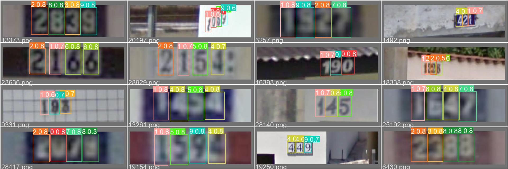

# yolov5-svhn-detection
 [](https://colab.research.google.com/github/googlecolab/colabtools/blob/master/notebooks/colab-github-demo.ipynb)

### [Report](./REPORT.pdf)

by [Zhi-Yi Chin](https://joycenerd.github.io/)

This repository is implementation of homework2 for IOC5008 Selected Topics in Visual Recognition using Deep Learning course in 2021 fall semester at National Yang Ming Chiao Tung University.

In this homework, we participate in the SVHN detection competition hosted on [CodaLab](https://competitions.codalab.org/competitions/35888?secret_key=7e3231e6-358b-4f06-a528-0e3c8f9e328e). The [Street View House Numbers (SVHN) dataset](http://ufldl.stanford.edu/housenumbers/) contains 33,402 training images and 13,068 testing images. We are required to train not only an accurate but fast digit detector. The submission format should follow COCO results. To test the detection model's speed, we must benchmark the detection model in the Google Colab environment and screenshot the results.



## Getting the code

You can download a copy of all the files in this repository by cloning this repository:

```
git clone https://github.com/joycenerd/yolov5-svhn-detection.git
```

## Requirements

You need to have [Anaconda](https://www.anaconda.com/) or Miniconda already installed in your environment. To install requirements:
```
conda env create --name detect python=3
conda activate detect
cd yolov5
pip install -r requirements.txt
```

## Dataset

You can download the raw data after you have registered the challenge mention above. 

### Data pre-processing

#### 1. Turning the `.mat` label file into YOLO format annotations.

```
python mat2yolo.py --data-root <path_to_data_root_dir>
```
* input: your data root directory, inside this directory you should have `train/` which saves all the training images and `digitStruct.mat` which is the original label file. 
* output: `<path_to_data_root_dir>/labels/all_train/` -> inside this folder there will have text files with the name same as the training image name, they are YOLO format annotations.

#### 2. Train validation split -> Split the original training data into 80% training and 20% validation.
```
python train_valid_split.py --data-root <path_to_data_root_dir> --ratio 0.2
```
* input: same as last step plus the output of last step
* output: 
    * `<path_to_data_root_dir>/images/`: inside this folder will have two subfolder `train/` (training images) and `valid/` (validation images).
    * `<path_to_data_root_dir>/labels/train/`: text files that contain training labels 
    * `<path_to_data_root_dir>/labels/valid/`: text files that contain validation labels

#### 3. Data configuration

Got to `yolov5/data/custom-data.yml` and modified `path`, `train`, `val` and `test` path


## Training

You should have Graphics card to train the model. For your reference, we trained on 2 NVIDIA RTX 1080Ti for 14 hours. Before training, you should download `yolov5s.pt` from `https://github.com/ultralytics/yolov5/releases/tag/v6.0`.

Recommended training command:
```
cd yolov5
python train.py --weights <yolo5s.pt_file> --cfg models/yolov5s.yaml --data data/custom-data.yaml --epochs 150 --cache --device <gpu_ids> --workers 4 --project <train_log_dir> --save-period 5
```
There are more setting arguments you can tune in `yolov5/train.py`, our recommendation is first stick with default setting.

* input: pre-trained `yolo5s.pt` downloaded from https://github.com/ultralytics/yolov5/releases/tag/v6.0
* output: logging directory `<train_log_dir>`. Note: if this is your first experiment there will be a subdirectory name `exp/`, if second `exp2` and so on. Inside this logging directory you can find:
  * `weights/`: All the training checkpoints will be saved inside here. Checkpoints is saved every 5 epochs and `best.pth` save the current best model and `last.pt` save the latest model.
  * tensorboard event
  * Some miscellaneous information about the data and current hyperparameter

## Validation
You can validate your training results by the following recommendation command:
```
cd yolov5
python val.py --data data/custom-data.yaml --weights <ckpt_path> --device <gpu_ids> --project <val_log_dir>
```

* input: your model checkpoint path

## Testing

You can do detection on the testing set by the following recommendation commend:
```
cd yolov5
python detect.py --weights <ckpt_path> --source <test_data_dir_path> --save-txt --device <gpu_id> --save-conf --nosave
```

* input: 
  * trained model checkpoint
  * testing images 
* output: `yolov5/runs/detect/exp<X>/labels/`will be generated, inside this folder will have text files with the same name as the testing images, and inside each text file is the detection results of the correspoding testing image in YOLO format.

## Post-processing

Turn YOLO format detection results into COCO format.
```
python yolo2coco.py --yolo-path <detect_label_dir>
```
* input: detection results in the testing step.
* output: `answer.json`

## Submit the results
Run this command to `zip` your submission file:
```
zip answer.zip answer.json
```
You can upload `answer.zip` to the challenge. Then you can get your testing score.

## Pre-trained models

Click into [Releases](https://github.com/yolov5-svhn-detection/releases). Under **My YOLOv5s model** download `yolov5_best.pt`. This pre-trained model get score 0.4067 on the SVHN testing set.

## Inference
To reproduce our results, run this command:
```
cd yolov5
python detect.py --weights <yolov5_best.pt_path> --source <test_data_dir_path> --save-txt --device <gpu_id> --save-conf --nosave
```

## Benchmark the speed
Open `inference.ipynb` using Google Colab and follow the instruction in it.

## Reproducing Submission

To reproduce our submission without retraining, do the following steps

1. [Getting the code](#getting-the-code)
2. [Install the dependencies](#requirements)
3. [Download the data and data pre-processing](#dataset)
4. [Download pre-trained models](#pre-trained-models)
5. [Inference](#inference)
6. [Post-processing](#post-processing)
6. [Submit the results](#submit-the-results)

## Results

* Testing score: 0.4067
* Detection speed: 227ms per image

## GitHub Acknowledgement
We thank the authors of these repositories:
* [ultralytics/yolov5](https://github.com/ultralytics/yolov5)

## Citation
If you find our work useful in your project, please cite:

```bibtex
@misc{
    title = {yolov5-schn-detection},
    author = {Zhi-Yi Chin},
    url = {https://github.com/joycenerd/yolov5-schn-detection},
    year = {2021}
}
```

## Contributing

If you'd like to contribute, or have any suggestions, you can contact us at [joycenerd.cs09@nycu.edu.tw](mailto:joycenerd.cs09@nycu.edu.tw) or open an issue on this GitHub repository.

All contributions welcome! All content in this repository is licensed under the MIT license.